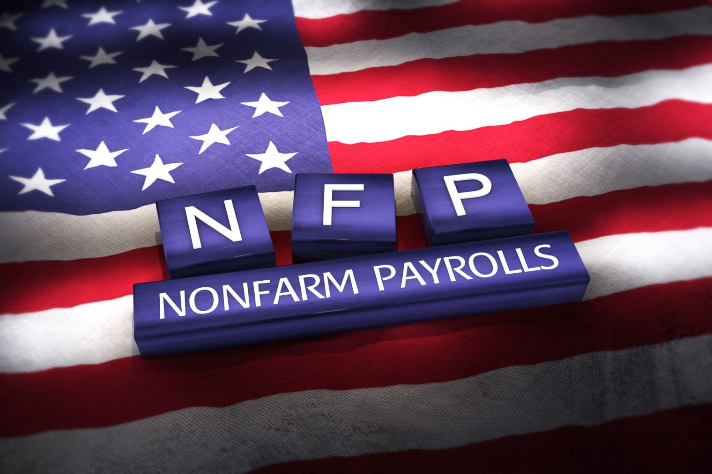

NFP Correlations
================

This project analyzes the correlation between the U.S. Non-Farm Payrolls (NFP) data and various financial instruments using historical market data from Dukascopy. The goal is to determine how markets react within an hour after the NFP announcement.

Analysis Goals
-----------------

*   Examine correlations between NFP percentage changes and:

    *   **USDJPY:** highest value after the announcement

    *   **USA500IDXUSD:** highest value after the announcement

    *   **BTCUSD:** lowest value after the announcement

    *   **XAUUSD (Gold):** lowest value after the announcement

    *   **BRENTCMDUSD (Brent Oil):** lowest value after the announcement

Build with
----------

Requirements
---------------

*   Python 3.8+

*   Required libraries:

    `   pip install -r requirements.txt   `

Installation & Setup
-----------------------

1.  Clone the repository:

    `   git clone https://github.com/Hyacinto/nfp_correlations.git  cd nfp_correlations   `

1.  Create and activate a virtual environment:

    `   python -m venv venv  source venv/bin/activate # On Windows: venv\Scripts\activate   `

1.  Install dependencies:

    `   pip install -r requirements.txt   `

1.  Add your Google Service Account Key for Google Sheets integration.

Usage
---------

`   streamlit run visualization.py   `

Methodology
--------------

*   Download historical minute-level data from Dukascopy.

*   Calculate the highest/lowest market movements within one hour of NFP announcements.

*   Compute the correlation matrix to visualize relationships.

 Example Output
-----------------

*   Heatmap showing the correlations between NFP changes and financial instruments.

Future Improvements
----------------------

*   Include more financial instruments.

*   Test with different timeframes around the NFP announcement.

